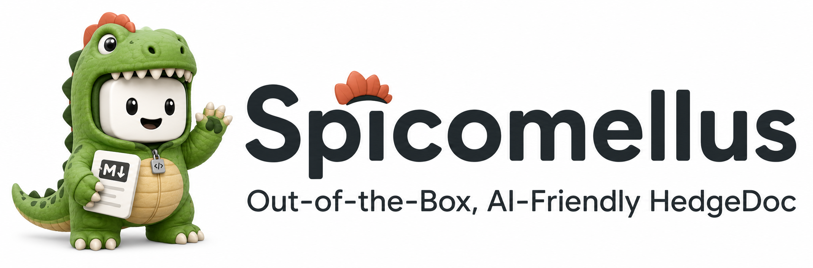

<!--
SPDX-FileCopyrightText: 2021 The HedgeDoc developers (see AUTHORS file)

SPDX-License-Identifier: CC-BY-SA-4.0
-->



Spicomellus is a folk of HedgeDoc, built for an AI-native knowledge workflow.

## Why Spicomellus

Recent AI research workflows increasingly treat Markdown as an intermediate format for machine reasoning, not just human writing.

As described by Andrej Karpathy, a practical loop is emerging:

1. Collect raw sources (papers, repos, articles, datasets, images).
2. Let an LLM continuously compile them into a Markdown wiki.
3. Use the same LLM to query, refine, lint, and expand that wiki.
4. Feed outputs back into the knowledge base so exploration compounds over time.

In this loop, AI-generated Markdown can be imported into a knowledge base and rendered into HTML for model-side consumption. As Anthropic's Thariq noted, this HTML layer is useful as machine-readable context for AI systems.

But for humans, plain Markdown-to-HTML is often not the best interface for understanding reasoning structure. Spicomellus focuses on **graph cards** as a first-class view: relationships between concepts, notes, and AI input/output become visually traceable like a mind map.

This gives teams and learners a faster way to:

- understand how an AI answer is grounded,
- inspect input/output chains and dependencies,
- spot gaps or contradictions,
- and make better decisions with less cognitive overhead.

Spicomellus exists to bridge both worlds at once:

- **AI-readable structure** (Markdown/HTML knowledge pipelines), and
- **human-readable structure** (graph-card cognition).

## Quick Start

Use Docker Compose to run Spicomellus quickly with backend, frontend, PostgreSQL, and Caddy.

1. Create `docker/.env` from the repository root:

```bash
cat > docker/.env <<'EOF'
HD_BASE_URL=http://127.0.0.1:8081
HD_AUTH_SESSION_SECRET=replace-with-at-least-32-characters
HD_DATABASE_TYPE=postgres
HD_DATABASE_HOST=db
HD_DATABASE_PORT=5432
HD_DATABASE_NAME=spicomellus
HD_DATABASE_USERNAME=spicomellus
HD_DATABASE_PASSWORD=spicomellus
EOF
```

2. Start all services:

```bash
docker compose -f docker/docker-compose.yml --env-file docker/.env up -d
```

3. Open `http://127.0.0.1:8081` in your browser.

4. Check logs if needed:

```bash
docker compose -f docker/docker-compose.yml --env-file docker/.env logs -f
```

5. Stop the stack:

```bash
docker compose -f docker/docker-compose.yml --env-file docker/.env down
```


## MCP Server

This repository includes a local MCP server in `mcp/` for agent workflows.

### Installation

1. Install dependencies in the monorepo root:

```bash
yarn install
```

2. Add a server entry to your VS Code MCP config (`~/.vscode-server/data/User/mcp.json` on remote Linux):

```jsonc
{
	"servers": {
		"Spicomellus": {
            "type": "stdio",
            "command": "/usr/bin/node",
            "args": [
                "/home/ianchen0119/Spicomellus/mcp/server.js"
            ],
            "env": {
                "HEDGEDOC_USERNAME": "agent",
                "HEDGEDOC_PASSWORD": "agentCopilot",
                "HEDGEDOC_BASE_URL": "http://127.0.0.1:8081",
                "HEDGEDOC_MCP_DEBUG": "1",
                "HEDGEDOC_MCP_OUTPUT_MODE": "ndjson"
            }
		}
	}
}
```

You can replace `HEDGEDOC_API_TOKEN` with `HEDGEDOC_USERNAME` and `HEDGEDOC_PASSWORD` for local auto-bootstrap.

4. Restart MCP clients (or VS Code) and verify the server can be discovered.

### Environment

- `HEDGEDOC_BASE_URL`: base URL of your Spicomellus instance, for example `http://localhost:3000`
- `HEDGEDOC_API_TOKEN`: a valid API token for the user the agent should act as

Optional (automatic token bootstrap for local auth):

- `HEDGEDOC_USERNAME`: local username
- `HEDGEDOC_PASSWORD`: local password
- `HEDGEDOC_BOOTSTRAP_TOKEN_LABEL`: label for the generated token (default: `spicomellus-mcp-auto`)

If `HEDGEDOC_API_TOKEN` is missing and username/password are provided, the MCP server will:

1. create a private session,
2. request CSRF token,
3. create an API token via private API,
4. use that token for MCP tools.

### Run

```bash
yarn workspace @hedgedoc/spicomellus-mcp start
```

### Tools

- `note_create`, `note_update`, `note_delete`
- `note_list_all`, `note_get`, `note_graph_get`
- `note_link_create`, `note_link_delete`
- `knowledge_base_read` for recursively collecting related notes

### Agent Skill

Load [`.github/skills/spicomellus/SKILL.md`](.github/skills/spicomellus/SKILL.md) alongside the MCP server to let compatible agents use Spicomellus autonomously as a persistent knowledge base. The skill defines discovery, retrieval, writing, linking, identifier, safety, and failure-handling workflows for all MCP tools.

- ℹ️ Read all about HedgeDoc and the history of the project on [our website](https://hedgedoc.org)

# License

Licensed under AGPLv3. For our list of contributors, see [AUTHORS](AUTHORS).

The license does not include the HedgeDoc logo, whose terms of usage can be found in
the [github repository](https://github.com/hedgedoc/hedgedoc-logo).

[matrix.org-image]: https://img.shields.io/matrix/hedgedoc:matrix.org?logo=matrix&server_fqdn=matrix.org

[matrix.org-url]: https://chat.hedgedoc.org

[matrix.org-dev-url]: https://chat.hedgedoc.org/dev

[github-version-badge]: https://img.shields.io/github/release/hedgedoc/hedgedoc.svg

[github-release-page]: https://github.com/hedgedoc/hedgedoc/releases

[github-release-feed]: https://github.com/hedgedoc/hedgedoc/releases.atom

[github-issue-tracker]: https://github.com/hedgedoc/hedgedoc/issues/

[poeditor-image]: https://img.shields.io/badge/POEditor-translate-blue.svg

[poeditor-url]: https://poeditor.com/join/project/1OpGjF2Jir

[hedgedoc-demo]: https://hedgedoc.org/demo/

[hedgedoc-demo-features]: https://demo.hedgedoc.org/features

[hedgedoc-community]: https://community.hedgedoc.org

[hedgedoc-community-calls]: https://community.hedgedoc.org/t/codimd-community-call/19

[social-mastodon]: https://social.hedgedoc.org/mastodon

[social-mastodon-image]: https://img.shields.io/mastodon/follow/109259563190314667?domain=https%3A%2F%2Ffosstodon.org&style=social

[reuse-workflow-badge]: https://github.com/hedgedoc/hedgedoc/workflows/REUSE%20Compliance%20Check/badge.svg

[nestjs-workflow-badge]: https://github.com/hedgedoc/hedgedoc/workflows/Nest.JS%20CI/badge.svg

[codecov-badge]: https://codecov.io/gh/hedgedoc/hedgedoc/branch/develop/graph/badge.svg?token=pdaRF4qjNQ

[codecov-url]: https://codecov.io/gh/hedgedoc/hedgedoc
